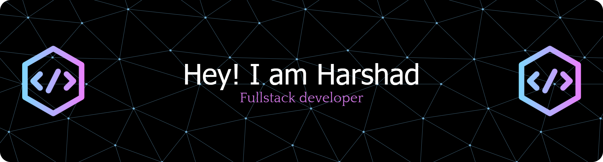

  

# 💫About Me :
🔭 I’m currently working on AI-ML projects, web development, and cybersecurity 
🌐 I have hands-on experience building web apps using HTML, CSS, JavaScript, Node.js, and MongoDB 
🤝 I’m looking to collaborate on open-source AI/ML, as well as participate in hackathons 
🌱 I’m currently learning C programming and advanced Python for AI-ML, and exploring React and APIs for dynamic websites 
💬 Ask me about Python, AI-ML, web development, or even productivity hacks 
⚡ Fun fact: I enjoy debugging more than coding—it feels like solving puzzles! 

## 🌐Socials

  <!-- Portfolio -->
  
  
  <!-- LinkedIn -->
  
  
  <!-- Mail -->
  
  
  <!-- LeetCode -->
  
  
  <!-- HackerRank -->
  
  
  <!-- Instagram -->
  
  
  <!-- Discord -->
  
  

###

###

# 💻Tech Stack
                   
# 📊GitHub Stats :
 
 

## 🏆GitHub Trophies

### ✍️Random Dev Quote

---

